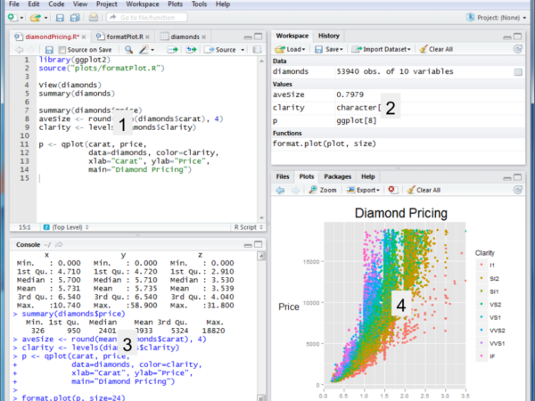
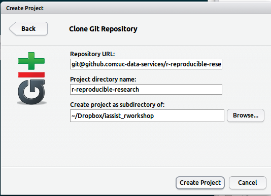

RStudio Intro - IASSIST Reproducible R Workshop
========================================================

## Installation

Requirements for the workshop:qw

* R - http://www.r-project.org/  
* RStudio -   http://www.rstudio.com/  
* Git -  http://git-scm.com/ 

If you don't want to install this on your machine, we've installed a version of RStudio server on our server http://doemo.lib.berkeley.edu/rstudio/.  Harrison can give you an account. 

### Quick note about R (more to come later)

R is an interactive statistical computing programming environment in the read–eval–print loop (REPL) style where: 

* **read** user types command in console prompt
* the command is **eval**uated
* the result is **print**ed to the console 
* and **loop** expresses the iterative and exploratory nature of how someone uses the above steps in practice

## RStudio

* An Integrated development enviroment for R
* Cross-platform (Linux, Mac, Win & Server version)
* Version control support (git & svn)
* Open source (AGPLv3)



1. Source editor with syntax highlighting & code completion
2. Workspace browser and data viewer
3. R console which also has code completion and function 
4. Plot history, zooming, and flexible image and PDF export. Integrated R help and documentation

## Exercise 1  - Creating a project and pulling files from github

We need to pull in some rcode for the workshop, so let's create a new project by Project>Create Project>Version Control

**repo url**: git@github.com:uc-data-services/r-reproducible-research.git  
**director**: r-iassist  (can be whatever you want)  
**folder**: navigate to folder of your choice (if on doemo you will already be in the right place)



Things to notice for step one:  

1. The files browser (lower right) allows you to set working directory. Notice that a command is reflected to the console.
2. A git menu in workspace tab shows up after a git clone giving you a way to interface with a git repository.

## Exercise 2 - Open an R source file & running code from the source & console.

Open up the rstudio.R file in your file browser. Highlight the following lines and use the run button to run the code in the console. Let's get started simple:

```{r}
1+1
```

And using the assignment operator **<-** create a vector v. Notice what happens if you press tab after starting to the function **seq**.

```{r}
v <- seq(1,100,by=5)
```

Use the command history to edit and change **v** to 1 to 200 by 3. See if you can find 3 different ways to access the command history. 

## Exercise 3 - Datasets in R and finding help

Let's look at the available 'learning' datasets that come with R. 

```{r}
data()
```

Find out more information on the mtcars dataset. Find the two ways to do this in RStudio. Help in R is extensive and covers functions, packages, and datasets. 

```{r}
?mtcars
```

```{r}
?summary
```

# Exercise 4 - Running some basic descriptive stats and loading a package.

Out of the box R has functions that provide basic stats, but often better functionality for more succinct outputs and more sophisiticated analysis is done via R packages. 

Assign the **mtcars** dataset to a variable. 

```{r}
mt <- mtcars
```

You can view the data frame by typing ***View(mt)*** in the cosole or clicking on ***mt*** in the Workspace area.

R can run basic descriptive stats out of the box with a function like summary(), but packages contributed by developers often provide better ways to output stats. This becomes more important the more sophisticated analysis that needs to be done. R's package system is extensive. 

```{r}
summary(mt)
```

But standard deviation isn't part of that function output and can't be run on a dataframe as a whole.

```{r}
sd(mtcars$mpg)
```

Install the **psych** module and then run its describe function on mt.

```{r}
describe(mt)
```

What's different with this output?

Look up the table function in help and then run it on carb column in mt. Hint: use the $ to access the carb column. 

## Exercise 5 -  Plotting 

The basic R plotting package doesn't produce beautiful graphs, but you can easily generate basic plots with it.  Harrison will show a publication quality graphics package later.

```{r}
hist(mt$mpg)
```

```{r}
plot(mt$mpg, mt$wt)
```

Run a boxplot on **mt**. 
