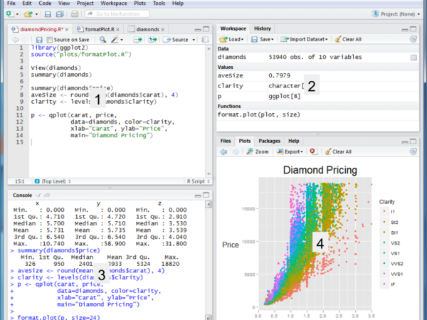
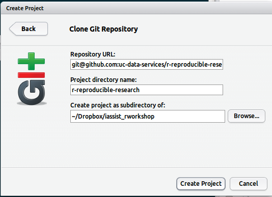

RStudio Intro - IASSIST Reproducible R Workshop
========================================================

## Installation

Requirements for the workshop:qw

* R - http://www.r-project.org/  
* RStudio -   http://www.rstudio.com/  
* Git -  http://git-scm.com/ 

If you don't want to install this on your machine, we've installed a version of RStudio server on our server http://doemo.lib.berkeley.edu/rstudio/.  Harrison can give you an account. 

### Quick note about R (more to come later)

R is an interactive statistical computing programming environment in the read–eval–print loop (REPL) style where: 

* **read** - the user types command in console prompt
* the command is **eval**uated
* the result is **print**ed to the console 
* and **loop** expresses the iterative and exploratory nature of how someone uses the above steps in practice

## RStudio

* An Integrated development enviroment for R
* Cross-platform (Linux, Mac, Win & Server version)
* Version control support (git & svn)
* Open source (AGPLv3)



1. Source editor with syntax highlighting & code completion
2. Workspace browser and data viewer
3. R console which also has code completion
4. Plot history, zooming, and flexible image and PDF export. Integrated R help and documentation

## Exercise 1  - Creating a project and pulling files from github

We need to pull in some R code for this part of the workshop, so let's create a new project by Project>Create Project>Version Control

**repo url**: git@github.com:uc-data-services/r-reproducible-research.git  
**directory**: r-iassist  (can be whatever you want)  
**folder**: navigate to folder of your choice (if on doemo you will already be in the right place)



Things to notice from step one:  

1. The files browser (lower right) allows you to set working directory. Notice that when you do an action in one of the windows the command is reflected to the console. This is helpful when you want to build up a script that will set up the R environment.
2. A git menu in workspace tab appears after a git clone giving you a way to interface with a git repository.

## Exercise 2 - Open an R source file & run code from the source/console.

Open up the rstudio.R file in your file browser. Highlight and run the code in exercise 1 (use the run button or ctrl-enter). 


```r
1 + 1
```

```
## [1] 2
```


And using the assignment operator **<-** create a vector v. Notice what happens if you press tab after starting to type the function **seq**.


```r
v <- seq(1, 100, by = 5)
```


Now, use the command history to edit and change **v** to 1 to 200 by 3. See if you can find 3 different ways to access the command history. 

## Exercise 3 - Datasets in R and finding help

Let's look at the available 'learning' datasets that come with R. 


```r
data()
```


Look for more information on the mtcars dataset. Find the two ways in RStudio to access help about functions, packages, and datasets. 


# Exercise 4 - Running some basic descriptive stats and loading a package.

Out of the box R has functions that provide basic stats, but often better functionality for more verbose outputs and more sophisticated analysis is provided via R packages. 

First, assign the **mtcars** dataset to a variable. 


```r
mt <- mtcars
```


This adds the mt dataframe to your workspace. You can view the dataframe by typing ***View(mt)*** in the console or clicking on ***mt*** in the Workspace area. Now run a summary of mt. 


```r
summary(mt)
```

```
##       mpg            cyl            disp             hp       
##  Min.   :10.4   Min.   :4.00   Min.   : 71.1   Min.   : 52.0  
##  1st Qu.:15.4   1st Qu.:4.00   1st Qu.:120.8   1st Qu.: 96.5  
##  Median :19.2   Median :6.00   Median :196.3   Median :123.0  
##  Mean   :20.1   Mean   :6.19   Mean   :230.7   Mean   :146.7  
##  3rd Qu.:22.8   3rd Qu.:8.00   3rd Qu.:326.0   3rd Qu.:180.0  
##  Max.   :33.9   Max.   :8.00   Max.   :472.0   Max.   :335.0  
##       drat            wt            qsec            vs       
##  Min.   :2.76   Min.   :1.51   Min.   :14.5   Min.   :0.000  
##  1st Qu.:3.08   1st Qu.:2.58   1st Qu.:16.9   1st Qu.:0.000  
##  Median :3.69   Median :3.33   Median :17.7   Median :0.000  
##  Mean   :3.60   Mean   :3.22   Mean   :17.8   Mean   :0.438  
##  3rd Qu.:3.92   3rd Qu.:3.61   3rd Qu.:18.9   3rd Qu.:1.000  
##  Max.   :4.93   Max.   :5.42   Max.   :22.9   Max.   :1.000  
##        am             gear           carb     
##  Min.   :0.000   Min.   :3.00   Min.   :1.00  
##  1st Qu.:0.000   1st Qu.:3.00   1st Qu.:2.00  
##  Median :0.000   Median :4.00   Median :2.00  
##  Mean   :0.406   Mean   :3.69   Mean   :2.81  
##  3rd Qu.:1.000   3rd Qu.:4.00   3rd Qu.:4.00  
##  Max.   :1.000   Max.   :5.00   Max.   :8.00
```


But notice that summary doesn't include standard deviation or range as part of the output. Let's install an R contributed package to get a better descriptive stats output. Go ahead and install **psych** module from the 'Package' tab in the lower right pane. Make sure its checked off after you install and then run its **describe()** function on mt.

Note the difference with the output.

## Exercise 5 -  Plotting 

The basic R plotting package doesn't produce beautiful graphs, but you can easily generate useful exploratory basic plots with it.  Harrison will show a publication quality graphics package later.


```r
hist(mt$mpg)
```

 


```r
plot(mt$mpg, mt$wt)
```

 

Run a boxplot on **mt**. 
